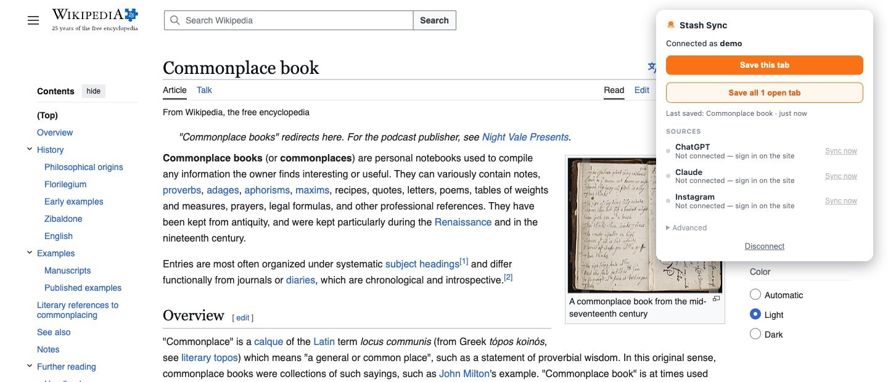
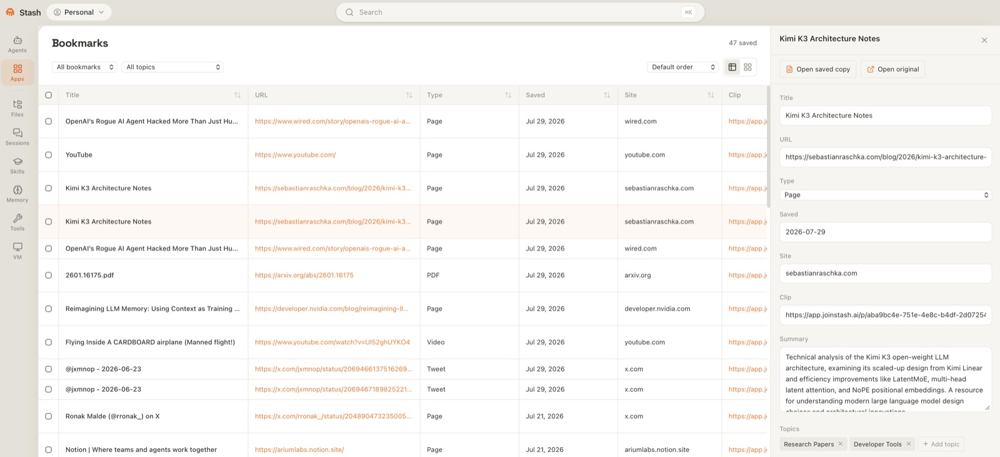
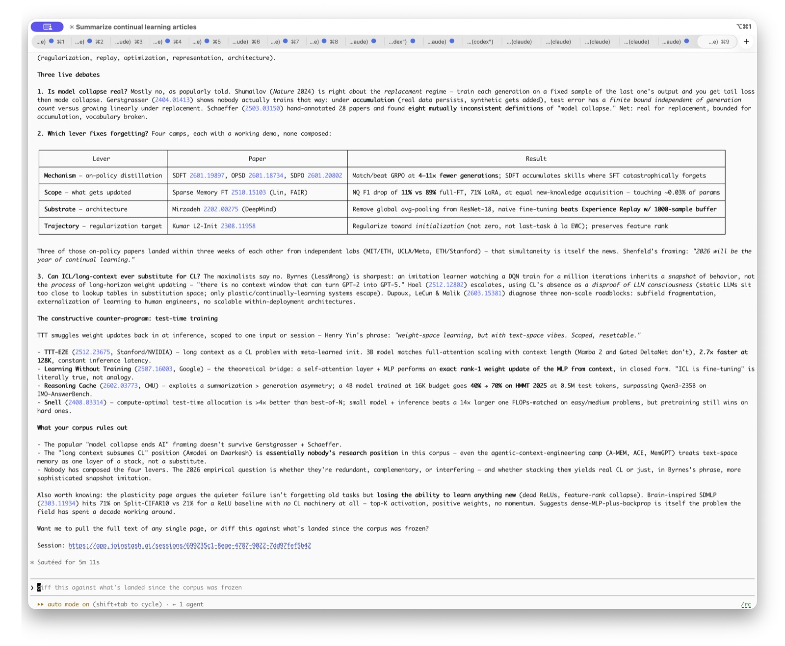
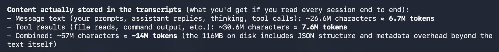
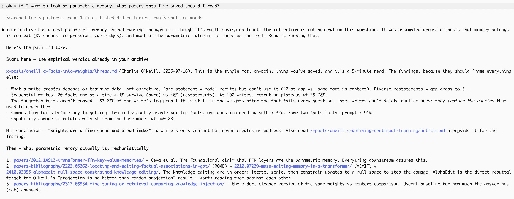

# AI-Native Bookmarks: the private internet library

## How it works

A bookmark manager whose reader is an agent, not you. Give your agents a personal
internet filled with all the best things you've opened, or never got around to, on the
inter-webs. Three steps.

### 1. Save anything from the web

**[Add to Chrome — it's free](https://chromewebstore.google.com/detail/stash-sync/cggimcbkomkpielefiannhmenmoehbea)**

A Chrome extension that saves websites, PDFs, YouTube videos, X posts, Instagram reels,
and ChatGPT or Claude chats straight into Stash. Automatic. Searchable. Read by your
agents.

- **Clip any page** — articles, PDFs, and every open tab. Saved clean and readable.
- **Bring your bookmarks** — import the whole file. We fetch what's behind every link.
- **Twitter bookmarks** — your X bookmarks, synced. Text, images, and threads kept.
- **AI chats** — ChatGPT and Claude, streamed in. Searchable like everything else.

Saving captures the **content**, not the URL, so a dead link still has the article behind it.

### 2. We maintain a private library and build an LLM wiki of key topics

We save everything to a private library that's filterable and sortable. The
saved copy stays readable even when the original goes away. Stash reads what comes in and
keeps a wiki of the topics you keep returning to, with each entry still attached to the
page it came from.

### 3. Your existing agents use Stash to get context right away

Claude, ChatGPT, and Cursor reach the whole library through the CLI or MCP, so they answer
out of what you've actually read. No new chatbot to switch to.

### What early users are doing with it

- Keeping on top of the deluge of AI papers.
- Making sure articles and books actually change something, instead of being consumed and forgotten.
- Studying for exams; collecting sources for essays.
- Maintaining situational awareness of an ecosystem or market.

---

# The case for a personal library

There's too much to consume as a single person. Between social media like tiktok and
twitter, news articles, youtube channels, and podcasts, we are suffocated with
information. The process of choosing what to read is overwhelming, never mind doing the
reading itself.

Google's original mission was to organize all of the world's information. Along with the
other companies that pioneered the internet, this became a race to gobble up as many data
sources as possible in order feed the machine. Along the way, the stacks of the library
became too numerous.

LLMs, with a little help from Jevon's paradox, is going to make this problem worse. In a
week since starting, our summer intern has generated 10M tokens or 100 books. Multiply
that across everyone on the internet and you have an enormous problem for anyone trying to
keep on top things. How do you know what to spend your preciously limited time actually
reading? The fact that LLMs tend to be quite verbose makes this worse as the density of
information across writing decreases and AI slop proliferates.

## What to do

Choosing to read only from trusted sources is one solution to this. Thoughtful, articulate
voices with reputations to stake will become ever more important over time. But this
cannot be a complete solution. Such a world would undermine the marketplace of ideas that
powers free speech and democratic societies. Smaller voices would be shut out and society
would become less diverse, less informed. It would lead to a form of mode collapse,
brought about by human vices rather than technical failure.

The solution, we believe, is to enable agents to be the intermediary. Agents read
everything and filter down to only what is worth reading. They can serve up all the
relevant information at the right time so that decision makers are fully informed. They
can serve as thought partners that are not necessarily smarter, but more informed than any
individual human can ever be. Whether that's making sure all the latest papers can be
brought to bear on a new research direction, resurfacing impactful perspectives in a
moment of personal crisis, or flagging hidden concerns during a major business decision.

In a lot of ways, we view the role of AI memory and knowledge bases such as Stash to be
the reverse of Google. The internet has given us all of the world's information. The
remaining job is to refine it into something that is useful.

The behaviors we envision are not without precedent. There are three patterns that we
think build a system which helps us manage the deluge.

### The commonplace book

Before the modern era, many kept a Common place book. It was a personal notebook that
accumulated quotes, passages, formulas, poems, or anything that might be useful later on.
This was something that had permanence because information back then was scarce. Each
scrape of information could change your life and it had to be preserved lest it be
forgotten. Nowadays, information is disposable, largely because it is so accessible and
plentiful. Today's tweet that could change your life is bookmarked for later. But later
never comes as the meme of tomorrow takes up its place in your attention.

### The briefing

Heads of state and senior officials receive briefings prepared for them by staff members.
These are condensed versions of reports that are compiled from across the apparatus.
Underneath each briefing is an iceberg of data that the principal doesn't see. That layer
of information is critical not only because it lends credibility to the briefing itself
but also because it is the accumulating body of context that informs tomorrow as much as
today.

### The 5 minute whiteboard chat

There is a paradox in academic communication: it takes many hours to write a paper, an
hour to deliver a talk, and 5 minutes to explain to a collaborator. Ostensibly, all 3 do
the same thing: explain a research idea to someone else. A key difference here is the
context that the audience has: your collaborator has enough of it that you can focus only
on explaining the final new step. For a general audience, you have to start at the
beginning. Those in your field are somewhere in between. This type of personalization
enables not only efficiency but also greater learning: the best teachers are able to teach
to your current level of understanding.

---

Each of these examples: the commonplace book, the hidden layer of information behind a
briefing, and the 5 minute collaborator chat, are sources of inspiration for us. We are
building Stash to incorporate these patterns with a modern, agentic twist.
